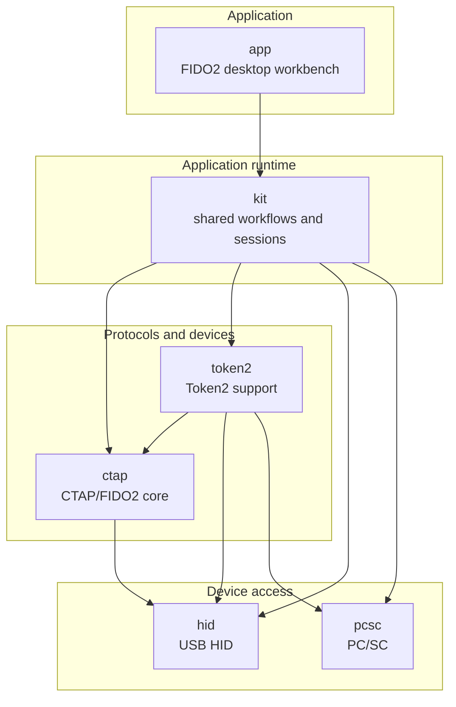

# go-ctap

Go libraries and runtime components for working with FIDO2, CTAP, CTAPHID and platform WebAuthn APIs.

## Repositories

| Repository                                    | Summary                                                                                                             |
|-----------------------------------------------|---------------------------------------------------------------------------------------------------------------------|
| [`app`](https://github.com/go-ctap/app)       | Wails desktop workbench for inspecting and managing local FIDO2/CTAP authenticators.                                |
| [`kit`](https://github.com/go-ctap/kit)       | Shared application runtime for discovery, sessions, operations, interaction prompts, safety checks, and MDS lookup. |
| [`ctap`](https://github.com/go-ctap/ctap)     | Core CTAP 2.0–2.3 implementation and stateful authenticator workflows.                                              |
| [`token2`](https://github.com/go-ctap/token2) | Token2 device support over PC/SC, USB HID feature reports, and CTAPHID.                                             |
| [`hid`](https://github.com/go-ctap/hid)       | Cross-platform, cgo-free access to HID devices.                                                                     |
| [`pcsc`](https://github.com/go-ctap/pcsc)     | Minimal, cgo-free PC/SC access for smart cards and security tokens.                                                 |

## Project map

Arrows point from each consumer to its direct in-organization dependencies.

